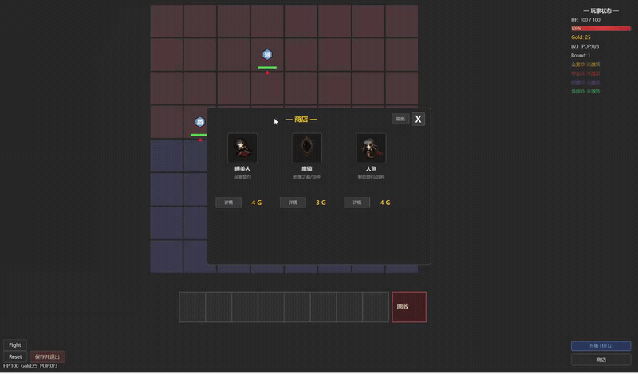
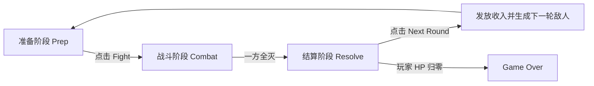
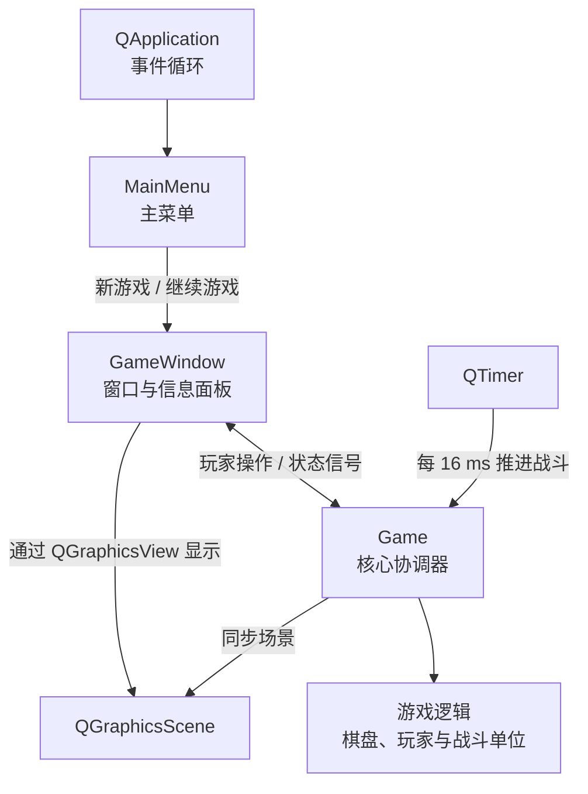
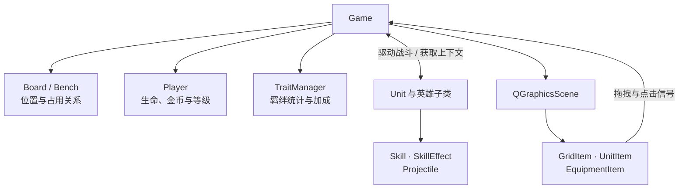
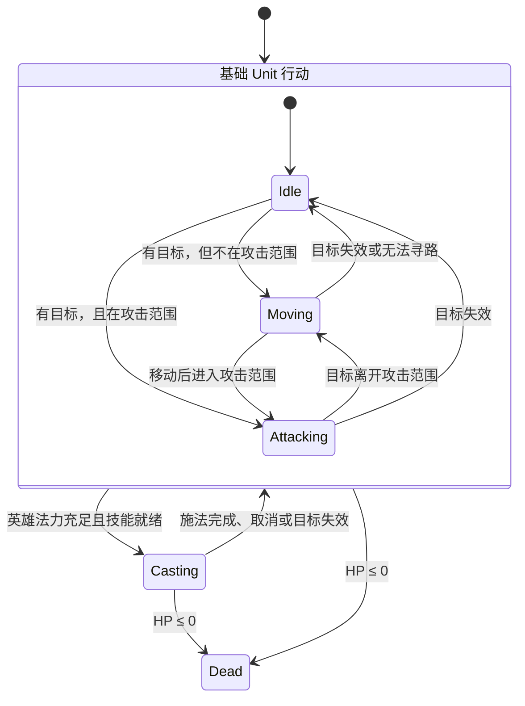

# Synera: Synergy Auto-Arena

Synera 是一个使用 C++17 与 Qt 6 开发的单机 PvE 自走棋游戏。玩家在准备阶段购买并布置童话角色，利用英雄技能、阵营羁绊、装备和经济系统构筑队伍；进入战斗后，单位会自动索敌、寻路、攻击并施放技能，最终在逐轮增强的敌军中生存下来。

这个项目重点实现了一套完整的小型自走棋循环，并将游戏规则、战斗实体、界面显示和交互按模块拆分，便于继续扩展角色、技能和玩法。

## 目录

- [Gameplay Demo](#gameplay-demo)
- [项目亮点](#项目亮点)
- [技术栈](#技术栈)
- [Quick Start](#quick-start)
  - [运行 Windows 发布版](#运行-windows-发布版推荐)
  - [使用 Qt Creator 从源码构建](#使用-qt-creator-从源码构建)
  - [存档位置](#存档位置)
- [Gameplay](#gameplay)
- [Architecture](#architecture)
- [Core Systems](#core-systems)
- [Qt Integration](#qt-integration)
- [项目状态与已知限制](#项目状态与已知限制)
- [文档与素材说明](#文档与素材说明)

## Gameplay Demo

[](docs/media/synera-gameplay-demo.mp4)

[▶ 观看完整游玩演示（MP4，约 25 秒）](docs/media/synera-gameplay-demo.mp4)

演示涵盖英雄购买与部署、阵容调整，以及两轮自动战斗。点击上方动图可以打开包含游戏音效的完整视频。

## 项目亮点

- 8×8 战斗棋盘和 8 格备战区，支持拖拽部署、换位、撤回和出售。
- 准备、战斗、结算三阶段循环，以及逐轮生成的 PvE 敌人与阵型。
- 8 名可购买英雄，每名英雄拥有独立属性、羁绊、技能和施法表现。
- 基于有限状态机的单位行为，以及索敌、BFS 寻路、近战和远程投射物系统。
- 金币、利息、商店刷新、人口升级、三合一升星、装备和羁绊系统。
- JSON 存档、继续游戏、背景音乐和战斗音效。
- 使用 Qt Graphics View 构建棋盘与单位显示，通过信号与槽连接 UI 和游戏状态。

## 技术栈

| 类别 | 技术 |
|---|---|
| 语言 | C++17 |
| GUI | Qt 6 Widgets、Qt Graphics View |
| 音频 | Qt Multimedia、`QSoundEffect` |
| 构建 | CMake 3.16+ |
| 已测试环境 | Windows 11、Qt 6.11.1、MinGW 64-bit |
| 数据存储 | Qt JSON、`QStandardPaths` |

## Quick Start

### 运行 Windows 发布版（推荐）

这条路径适合只想体验游戏、不准备安装 Qt 或编译器的用户。

1. 打开项目的 [Releases 页面](https://github.com/luck-lak/Synera--Synergy-Auto-Arena/releases/latest)。
2. 在 **Assets** 中下载 `release.zip`。
3. 将压缩包完整解压到一个新文件夹；不要直接在压缩包预览窗口中运行程序。
4. 进入解压后的目录，双击 `Synera_Starter.exe`。

发布包已经包含所需的 Qt 运行库、插件和游戏素材，不需要另外安装 Qt。请保留目录结构，不要只把 EXE 单独移动出来；`assets/` 中存放着角色图片、动画帧和声音资源。

### 使用 Qt Creator 从源码构建

这条路径适合阅读、修改和调试源码的开发者。

构建要求：

- Qt 6，包含 `Core`、`Widgets`、`Gui` 和 `Multimedia` 组件
- CMake 3.16 或更高版本
- 支持 C++17 的编译器；当前项目使用 MinGW 64-bit 测试

构建步骤：

1. 克隆仓库，并进入项目目录：

   ```bash
   git clone https://github.com/luck-lak/Synera--Synergy-Auto-Arena.git
   cd Synera--Synergy-Auto-Arena
   ```

2. 启动 Qt Creator，选择 **Open File or Project**，打开项目根目录的 `CMakeLists.txt`。
3. 选择 Qt 6 Desktop Kit，例如 `Desktop Qt 6.11.1 MinGW 64-bit`，然后确认 **Configure Project**。
4. 点击 **Build**，等待 CMake 配置和编译完成。
5. 在 Qt Creator 显示的构建目录中找到 `Synera_Starter.exe`，把项目根目录下完整的 `assets/` 文件夹复制到 EXE 所在目录。
6. 回到 Qt Creator 点击 **Run**。如果要直接双击构建出的 EXE，还需要保证 Qt 运行库可被系统找到；制作独立分发包时应使用 `windeployqt` 收集这些依赖。

最终运行目录至少应为：

```text
<build-directory>/
├── Synera_Starter.exe
└── assets/
    ├── sounds/
    └── ...
```

当前 `CMakeLists.txt` 尚未自动复制资源，因此第 5 步不能省略。GitHub Releases 中的 Windows 压缩包已经完成资源复制和 `windeployqt` 部署。

### 存档位置

游戏将存档写入用户文档目录：

```text
Documents/Synera/save.json
```

只有检测到有效存档时，主菜单中的“继续游戏”按钮才会启用。

## Gameplay

### 游戏目标

玩家通过商店组建队伍，将英雄部署在棋盘下半区。每轮开战后，双方单位自动行动；击败全部敌人即可获得收益并进入下一轮，失败则扣除玩家生命值。玩家生命值降至 0 时游戏结束。

### 单轮流程



准备阶段可以调整阵容；战斗阶段由 AI 接管单位；结算阶段显示胜负、生命损失或收益。进入下一轮时，系统发放金币、刷新商店、生成新的敌人并自动保存。

### 基本操作

| 操作 | 作用 |
|---|---|
| 左键拖拽英雄 | 在棋盘和备战区之间移动或交换英雄 |
| 将英雄拖到回收区 | 出售英雄并返还金币 |
| 右键英雄 | 打开或关闭单位详情面板 |
| 拖拽装备到英雄 | 为英雄穿戴装备 |
| 点击详情面板中的装备槽 | 卸下装备并放回装备栏 |
| `Fight` | 从准备阶段进入战斗 |
| `Next Round` | 结算后进入下一轮 |
| `Reset` | 将本轮单位恢复到开战前状态 |
| `保存并退出` | 写入 JSON 存档并返回主菜单 |

只有准备阶段允许重新布阵。玩家单位只能部署在棋盘下半区，棋盘人口不能超过当前人口上限。

### 经济与成长

- 玩家初始拥有 100 HP、25 金币和 3 人口上限。
- 商店每次随机展示 3 名不同英雄。
- 每轮前三次刷新各消耗 1 金币，之后每次消耗 2 金币；进入新一轮后重新计数。
- 每轮基础收入为 8 金币，另有胜负奖励和利息。
- 每 10 金币提供 1 金币利息，利息最多为 3 金币。
- 花费金币可以升级，等级上限为 6，人口上限随等级提高。
- 3 个同名、同星级英雄会自动合成为更高星级；2 星基础属性为 1 星的 1.8 倍，3 星为 1.8² 倍。

### 英雄与技能

| 英雄 | 羁绊 | 定位与技能 |
|---|---|---|
| 灰姑娘 | 金冕盟约 | 远程法师；“水晶鞋”对目标造成单体伤害 |
| 白雪 | 金冕盟约 | 高生命控制；“玻璃棺封印”使目标无法行动且无法被攻击 |
| 睡美人 | 金冕盟约 | 远程控制；“百年沉睡”使目标无法行动但仍可被攻击 |
| 大灰狼 | 野血盟约、异种 | 高速近战；“撕碎剧本”强化自身攻速与移速 |
| 人鱼 | 野血盟约、异种 | 范围法师；“泡沫化身”提供短暂无敌并伤害周围敌人 |
| 魔镜 | 烬墨之裔、异种 | 远程辅助；“照见本质”提高目标受到的伤害 |
| 小火苗 | 烬墨之裔 | 远程爆发；“最后一把火柴”对全体敌人造成伤害 |
| 无邀者 | 烬墨之裔 | 诅咒法师；“空白结局”对目标施加持续伤害 |

英雄通过普通攻击回复法力。法力满足要求后，英雄子类进入施法状态，完成读条后调用各自的 `Skill::execute()`；技能随后进入冷却。

### 羁绊

| 羁绊 | 触发条件与效果 |
|---|---|
| 金冕盟约 | 2/3 名英雄时提高生命上限 |
| 野血盟约 | 2 名英雄时提高攻击速度与移动速度 |
| 烬墨之裔 | 2/3 名英雄时提高普通攻击回蓝 |
| 异种 | 2/3 名英雄时提高攻击力，最高层额外提高移动速度 |

羁绊只统计棋盘上存活的玩家单位。战斗开始时统一计算，战斗结束时精确撤销，避免加成污染英雄的基础属性。

## Architecture

### 运行时结构

先看程序运行时的主干关系：



`GameWindow` 负责界面组合，`Game` 负责规则与流程，两者通过直接调用和 Qt 信号交换操作与状态。战斗阶段由 `QTimer` 周期性调用 `Game`；`Game` 更新逻辑对象后，再把结果同步到 `QGraphicsScene`，由窗口中的 `QGraphicsView` 显示。

继续展开 `Game` 内部，核心对象之间的关系如下：



这里的双向箭头只保留在 `Game` 与单位之间：`Game` 在每个 Tick 中驱动单位更新，而单位的寻路、技能和投射物又需要读取 `Game` 提供的棋盘、目标及场景上下文。图形项不负责判定游戏规则；它们读取状态完成绘制，并把鼠标操作发送给 `Game` 统一验证。

### 源码目录

```text
src/
├── main.cpp              程序入口，切换主菜单与游戏窗口
├── core/                 回合、棋盘、备战区、寻路、羁绊和英雄工厂
├── entity/               Unit、Player、Projectile 与 8 个英雄类
├── skill/                技能基类、状态效果与各英雄技能
├── equipment/            装备数据结构和基础装备池
├── gui/                  棋盘格、单位、装备和信息面板
├── shop/                 商店、英雄卡片和英雄详情
└── audio/                音效加载、播放与 BGM 管理
```

### 逻辑对象与图形对象分离

项目没有把规则直接写进绘图对象：

- `Unit` 保存生命、攻击、法力、状态、目标、路径、技能效果和装备。
- `UnitItem` 读取 `Unit` 状态并绘制精灵、血条、蓝条和星级，同时发送鼠标事件。
- `Board` 与 `Bench` 保存逻辑位置及反向索引。
- `QGraphicsScene` 保存场景中的棋盘格、单位图形、装备和投射物。
- `Game::syncUnits()` 在逻辑状态改变后同步图形位置、可见性和绘制状态。

这种划分让战斗规则集中在 `core/` 与 `entity/`，Qt 图形代码主要留在 `gui/`。

## Core Systems

### 阶段与战斗 Tick

`Game::Phase` 定义三个阶段：

- `Prep`：允许购买、出售、换位、穿戴装备和升级。
- `Combat`：启动间隔为 16 ms 的 `QTimer`，禁用布阵操作。
- `Resolve`：停止计时器，结算胜负并等待下一轮。

每次 `Game::onCombatTick()` 按以下顺序推进：

1. 为每个存活且在棋盘上的单位重新评估目标。
2. 根据距离、冷却和技能状态决定单位状态。
3. 更新技能冷却、状态效果和受击表现。
4. 执行移动或攻击。
5. 更新已经发射的投射物。
6. 从逻辑棋盘移除死亡单位，并处理装备掉落。
7. 同步场景显示并检查战斗是否结束。

### 单位状态机

`Unit` 定义 `Idle`、`Moving`、`Attacking`、`Casting` 和 `Dead` 五种状态。其中基础 `Unit::decideState()` 只负责前三种普通行动状态；八个英雄子类通过重写 `decideState()` 和 `tickCooldowns()`，在普通行动逻辑外增加施法流程。



没有有效目标时，单位保持或回到 `Idle`；只有已经选中目标、但目标不在攻击范围内时，单位才会进入 `Moving` 并进行寻路。英雄子类会先处理施法：当前实现只要法力充足且技能冷却结束，就可以从任一普通行动状态进入 `Casting`，并不统一检查攻击距离。读条期间目标失效会取消施法；读条完成后调用该英雄自己的 `Skill::execute()`、消耗法力、启动技能冷却并回到 `Idle`。

图中的 `Normal` 只是为了归纳基础 `Unit` 管理的三种状态，并不是代码中的额外枚举值。各技能的作用范围和目标规则由具体实现决定：有些技能作用于当前目标，有些强化自身，有些遍历全体敌人或以施法者为中心计算范围，因此不在这张公共状态图中展开。沉睡与封印会阻止行动，但二者对“能否被攻击”的规则不同。

### 索敌与 BFS 寻路

`Unit::findTarget()` 排除自己、友军、死亡单位、备战区单位以及不可被锁定的封印单位，然后按以下顺序选择目标：

1. 欧氏距离平方更小；
2. 距离相同时，生命值更低；
3. 再相同时，`x` 坐标更小；
4. 最后比较 `y` 坐标。

`Game::findpath()` 在 8×8 网格上使用四方向 BFS。已被其他单位占用的格子视为障碍；搜索到目标格后返回目标前方的最短路径，使攻击者不会与目标占据同一格。单位在每次可移动的 Tick 重新计算路径，因此能够适应战场占用变化。

### 攻击、法力与投射物

- 近战攻击命中时直接结算伤害。
- 远程攻击创建 `Projectile`，加入 `QGraphicsScene`，到达目标后再结算伤害。
- 攻击伤害会经过无敌和易伤等效果判断。
- 普通攻击后回复法力，并重置攻击冷却。
- 投射物离开发射者后独立更新，即使发射者死亡也会继续飞行。

### 技能与状态效果

`Skill` 抽象类统一管理技能名称、法力消耗、施法帧和冷却帧，并通过纯虚函数 `execute(Unit*, Game*)` 提供英雄专属效果。

`SkillEffect` 统一表示攻速变化、移速变化、持续伤害、持续治疗、易伤、无敌、封印和沉睡。效果具有剩余帧数和来源指针，可按时间失效，也可在羁绊结束时按来源集中撤销。

### 升星与装备

购买英雄后，`Game::tryMergeStarUp()` 搜索同名、同星级的三个单位。合成时会：

1. 收集三个单位的全部装备；
2. 删除两个被合成单位；
3. 提升保留单位的星级并根据 1 星基础值重算属性；
4. 在新星级允许的装备槽内重新穿戴，多余装备返回装备栏；
5. 再次检查是否可以连锁升星。

装备在战斗中由敌方单位掉落。装备栏中的图标可以拖到英雄身上；已穿戴装备可以通过单位详情面板卸下。

### 存档与恢复

`Game::saveToFile()` 将轮次、玩家状态、玩家单位、位置、星级、当前 HP/法力、装备槽和装备栏序列化为 JSON。读取时通过 `HeroFactory` 根据英雄名称重建正确的派生类，再恢复属性和装备，重新生成当轮敌人并构建场景。

## Qt Integration

项目中的 Qt 主要负责应用生命周期、窗口、绘制、事件和数据序列化；核心战斗规则仍然是普通 C++ 类和函数。

| Qt 机制 | 在项目中的作用 |
|---|---|
| `QApplication` | 创建 GUI 应用并启动事件循环 |
| `QWidget` / `QMainWindow` | 主菜单、游戏窗口和信息面板 |
| `Q_OBJECT` | 让自定义类使用 Qt 元对象系统、信号和槽 |
| `signals` / `slots` / `connect` | 解耦按钮、拖拽事件、游戏状态和界面刷新 |
| `QGraphicsScene` / `QGraphicsView` | 保存并显示棋盘、单位、装备和投射物 |
| `QGraphicsObject` | 为棋盘格、单位和装备提供绘制与鼠标事件 |
| `QTimer` | 每 16 ms 触发一次战斗更新；也用于延迟返回菜单 |
| `QString` / `QList` / `QVector` / `QHash` | Qt 生态中的字符串和容器类型 |
| `QJsonDocument` / `QJsonObject` | JSON 存档序列化与反序列化 |
| `QStandardPaths` | 获取跨平台的用户文档目录 |
| `QSoundEffect` | 预加载并播放音效与循环 BGM |

Qt 的父子对象机制也承担部分内存管理。例如 `Game` 以 `GameWindow` 为父对象，`QGraphicsScene` 和 `QTimer` 又以 `Game` 为父对象；父对象销毁时，Qt 会销毁这些子对象。普通 C++ 游戏对象仍由项目显式管理。

## 项目状态与已知限制

- 当前主要在 Windows 11、Qt 6.11.1 和 MinGW 64-bit 环境下验证。
- `assets/` 尚未通过 Qt Resource System 打包，构建后需要复制到运行目录。
- 独立 Windows 发布包仍需通过 `windeployqt` 收集 Qt 运行库和插件。
- 当前敌人使用预设波次、阵型和单位模板，不包含联网 PvP。
- 项目尚未加入自动化测试，主要通过游戏内流程进行验证。

## 文档与素材说明

- 课程作业时期的完整说明保存在 [`docs/course-report.md`](docs/course-report.md)。
- 部分角色和敌人图像来自第三方素材包，相关说明文件保留在对应的 `assets/` 子目录中。
- 在重新分发素材或发布正式版本前，请再次核对各素材包的授权范围与署名要求。
